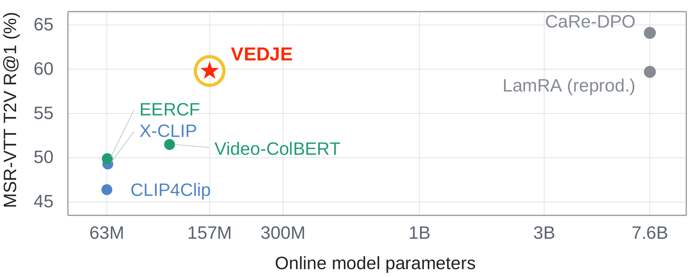

<div align="center">

<h1>VEDJE: Video-Efficient Discriminative Joint Encoder for Scalable Video-Text Retrieval</h1>

<p><b>VEDJE adds joint text-video matching to two-stage video search without encoding videos at query time.</b></p>

<p>
<a href="https://github.com/shahafwa">Shahaf Wagner</a><sup>1*</sup>&nbsp;&nbsp;
<a href="https://scholar.google.com/citations?user=GJ19YUEAAAAJ&amp;hl=en">Gabriele Serussi</a><sup>1,3*</sup>&nbsp;&nbsp;
<a href="https://scholar.google.com/citations?user=OmIy5cgAAAAJ">Dan Ben Ami</a><sup>1</sup>&nbsp;&nbsp;
<a href="https://scholar.google.com/citations?user=ut_ISVIAAAAJ">Tomer Galanti</a><sup>2</sup>&nbsp;&nbsp;
<a href="https://chaimbaskin.bgu.ac.il/">Chaim Baskin</a><sup>1,3</sup>
</p>

<p>
<sup>1</sup>INSIGHT Lab, Ben-Gurion University of the Negev&nbsp;&nbsp;&nbsp;
<sup>2</sup>Texas A&amp;M University&nbsp;&nbsp;&nbsp;
<sup>3</sup>Decart.ai<br>
<sup>*</sup>Equal contribution
</p>

<p>
<a href="https://gabrieleserussi.github.io/vedje/"></a>
<a href="https://colab.research.google.com/github/GabrieleSerussi/vedje/blob/main/colab/vedje_tour.ipynb"></a>
<a href="https://github.com/GabrieleSerussi/vedje/actions/workflows/tests.yml"></a>
<a href="LICENSE"></a>
</p>



</div>

VEDJE reranks first-stage video candidates with a 33M-parameter joint encoder that reads a compact cache written once per video. The cache keeps a few learned tokens per sampled frame, and feature-change supervision during training improves retrieval from it without adding query-time work. This repository holds the VEDJE package, one script per method step, five of the paper's configurations, a CPU check of its numbers and the tests.

## Quick start

1. **Install** (Python 3.10 or newer). This also installs stock `transformers>=5.13`, which provides the VideoPrism models:

   ```bash
   git clone https://github.com/GabrieleSerussi/vedje.git
   cd vedje
   pip install -e .
   ```

2. **Check the paper's numbers on a CPU**, in under a minute:

   ```bash
   python reproduce/cpu_check.py
   ```

   It measures the cache sizes, the storage ratio and the cache traffic per query, and counts the parameters of the reranker. The first run downloads MiniLM.

3. **Run VEDJE on your own videos**, one command per method step:

   ```bash
   CFG=configs/vedje_vp_msrvtt.yaml
   python scripts/extract_features.py --config $CFG          # 1. index the videos once
   python scripts/stage1_train_embeddings.py --config $CFG   # 2a. stage-1 embeddings of the training set
   python scripts/mine_hard_negatives.py --config $CFG       # 2b. stage-1 hard negatives
   python scripts/stage1_test_features.py --config $CFG      # 3. stage-1 embeddings of the test set
   python scripts/train.py --config $CFG --output_dir output/vp_msrvtt                       # 4. train
   python scripts/evaluate.py --config $CFG --checkpoint output/vp_msrvtt/checkpoint_03.pth  # 5. rerank and evaluate
   ```

   Every script takes its paths and settings from the config. The defaults come from the MSR-VTT config, with the videos and annotations under `./data_root/msrvtt/` and a GPU when one is available. The other datasets and the VideoCLIP-XL setting have their own files in [`configs/`](configs), and [REPRODUCING.md](REPRODUCING.md) describes the annotation formats.

## How it works

<p align="center">

</p>

Offline, a frozen backbone encodes each video once, and a shared compressor writes a few tokens per sampled frame in temporal order. At query time, a 33M-parameter joint encoder reads the query together with the cache of each candidate. The first-stage score is embedded and added to the encoder's output before the score head. During training, a future-delta head predicts how the frozen features change between sampled frames; it is discarded afterwards.

| Step | What it does | Script |
| --- | --- | --- |
| 1. Index videos | Encodes each video once with the frozen VideoPrism-B backbone and stores its frame-indexed patch features. | [`scripts/extract_features.py`](scripts/extract_features.py) |
| 2 and 3. Stage-1 embeddings and hard negatives | Embeds the training and test videos and captions with the first-stage retriever (VideoPrism-LvT) and mines the closest wrong videos for each training caption. | [`scripts/stage1_train_embeddings.py`](scripts/stage1_train_embeddings.py), [`scripts/mine_hard_negatives.py`](scripts/mine_hard_negatives.py), [`scripts/stage1_test_features.py`](scripts/stage1_test_features.py) |
| 4. Train | Trains the frame-indexed compressor, the joint reranker, the prior embedding, the score head and the training-only heads. | [`scripts/train.py`](scripts/train.py) |
| 5. Rerank and evaluate | Retrieves candidates with the first stage, reranks them from their caches and reports R@1, R@5 and R@10 in both directions. | [`scripts/evaluate.py`](scripts/evaluate.py) |

## Results

- VEDJE reaches 59.8 MSR-VTT text-to-video R@1 with about 157M online parameters, using a fine-tuned VideoCLIP-XL first stage. The LamRA reproduction reaches 59.7 with a 7.6B base decoder, about 49 times that count (Figure 1, Table 22 and Appendix B).
- VEDJE improves R@1 over each matched first stage on MSR-VTT by 3.6 to 7.2 points, in both directions (Table 1b). The first stages are VideoPrism, PE-Core-B and VideoCLIP-XL, zero-shot and fine-tuned.
- With the zero-shot VideoCLIP-XL first stage, VEDJE improves text-to-video R@1 by 4.9 to 8.9 points on MSR-VTT, MSVD, DiDeMo and ActivityNet (Table 12).
- The default cache stores 48 KiB per video, 128.5 times less than the frame-and-patch features of the same backbone (Section 4.3 and Table 9).
- In the VideoPrism configuration on MSR-VTT, the 12 KiB cache keeps text-to-video R@1 within 0.2 points of the 48 KiB cache (Table 3).

## Reproducing the paper

[REPRODUCING.md](REPRODUCING.md) maps each table and figure of the paper that this code covers to its config and commands. It also lists the inputs to provide, namely videos, annotation files and, for the VideoCLIP-XL setting, precomputed features, and what the release does not contain.

## Repository layout

```
vedje/        the package: cache, delta, model, features, video, lvt, retrieval, data, config, paper
scripts/      one script per method step, from indexing to evaluation
configs/      five configurations of the paper
reproduce/    cpu_check.py, numbers of the paper recomputed on a CPU
artifacts/    paper_results.json, the numbers of the paper that the README and the notebook chart
tests/        the test suite (pytest, CPU only)
docs/         the project page
colab/        the Colab tour
```

## Using VEDJE with another backbone

VEDJE reads frozen features, so another visual backbone needs three changes.

1. **Features.** Write one `.pt` file per video with two tensors. `local_patches` holds the `(T*P, D)` patch features in frame order, with frame t in rows t*P to t*P+P-1. `v_global` is a `(C,)` global feature of the video, which training uses only without stage-1 embeddings. [`vedje/features.py`](vedje/features.py) and [`scripts/extract_features.py`](scripts/extract_features.py) do this for VideoPrism-B.
2. **Encoder entry.** Add the backbone to `ENCODER_CONFIGS` in [`vedje/model.py`](vedje/model.py), for example `"my_backbone": {"vision_dim": D, "clip_dim": C, "patches_per_frame": P}`.
3. **Config.** Copy a config and set `vision_encoder: "my_backbone"`, `num_frames` (T), `num_queries_per_frame` (M) and `precomputed_features_dir`. The cache then holds T x M tokens. `lvt_embeds_path` and `lvt_test_features_path` point to your first stage's embeddings of the training and test sets. The training embeddings also give the contrastive targets. [`configs/vedje_vclip_msrvtt.yaml`](configs/vedje_vclip_msrvtt.yaml) does this for VideoCLIP-XL features.

## Citation

```bibtex
@misc{wagner2026vedje,
  title={VEDJE: Video-Efficient Discriminative Joint Encoder for Scalable Video-Text Retrieval},
  author={Shahaf Wagner and Gabriele Serussi and Dan Ben Ami and Tomer Galanti and Chaim Baskin},
  year={2026},
  note={Preprint},
}
```

## License

The code is released under the MIT License ([LICENSE](LICENSE)). [THIRD_PARTY_NOTICES.md](THIRD_PARTY_NOTICES.md) lists the third-party code and the model checkpoints that the code downloads, with their licences.
